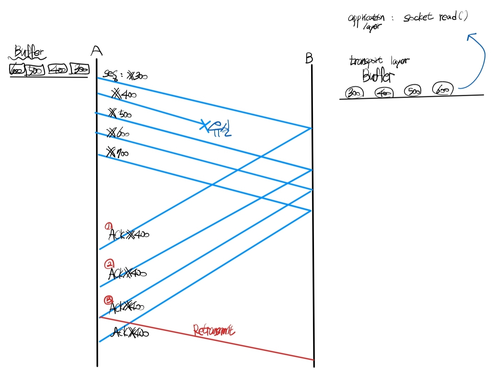
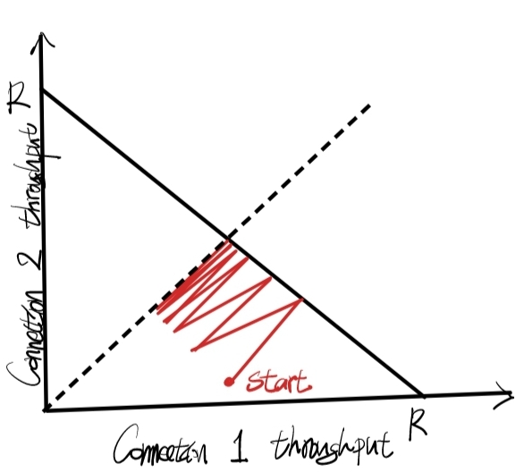
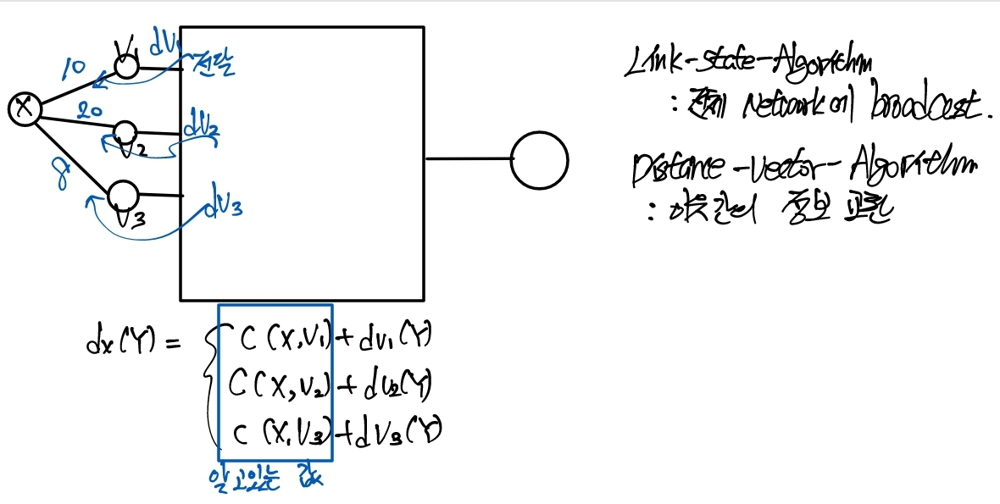

# Computer Network
-----------------
## 1강 정리
### Application Layer

  

#### HTTP (Hyper Text Transfer Protocol) :
*Web은 HTTP의 별칭*  
>W3 상에서 정보를 주고 받을 수 있는 프로토콜 
 주로 문서를 주고 받으며 TCP를 사용함. 
 TCP는 reliable trasport 하기 떄문에 패킷의 손실없이 송수신가능 
대신 UDP보다 비싼 비용을 내야함. Network resource에 대한 비용. 
 HTTP/3 부터는 UDP를 사용. 
Client <--> Server 간 요청,응답 프로토콜로 구성됨. 
굉장히 단순한 프로토콜. 저장 등 다른 기능이 없음.
  

 #### W3 (World Wide Web) :
 >인터넷에 연결된 컴퓨터를 통해 사람들이 정보를 공유할 수 있는 전세계적 정보 공간
  

#### 인터넷 프로토콜 슈트(영어: Internet Protocol Suite) : 

>인터넷에서 컴퓨터들이 서로 정보를 주고받는 데 쓰이는 통신규약(프로토콜)의 모음이다. 인터넷 프로토콜 슈트 중 TCP와 IP가 가장 많이 쓰이기 때문에 TCP/IP 프로토콜 슈트라고도 불린다.
  

#### TCP와 IP
    - > UDP : unreliable, connectionless, no flow control, no congestion control 
    - > TCP : reliable, connection-oriented, flow control, congestion control 

TCP/IP는 패킷 통신 방식의 인터넷 프로토콜인 IP (인터넷 프로토콜)와 전송 조절 프로토콜인 TCP (전송 제어 프로토콜)로 이루어져 있다.  IP는 패킷 전달 여부를 보증하지 않고, 패킷을 보낸 순서와 받는 순서가 다를 수 있다.(unreliable datagram service) TCP는 IP 위에서 동작하는 프로토콜로, 데이터의 전달을 보증하고 보낸 순서대로 받게 해준다.  HTTP, FTP, SMTP 등 TCP를 기반으로 한 많은 수의 애플리케이션 프로토콜들이 IP 위에서 동작하기 때문에, 묶어서 TCP/IP로 부르기도 한다.
  

- TCP (Transmission Control Protocol):  
>전송제어 프로토콜
IP(Internet Protocol Suite)의 핵심.  
TCP/IP라고도 부름  
TCP는 근거리 통신망이나 인트라넷, 인터넷에 연결된 컴퓨터에서 실행되는 프로그램 간에 일련의 옥텟을 안정적으로, 순서대로, 에러없이 교환할 수 있게 한다. 
TCP는 전송 계층에 위치한다.
  

- UDP 사용자 데이터그램 프로토콜(User Datagram Protocol) :  

>인터넷 프로토콜 스위트의 주요 프로토콜 가운데 하나

 

패킷스위칭의 단점 :  너무 많은 양의 데이터가 라우터에 할당되면
1. 큐에서 대기하는 시간. 딜레이가 늘어남
2. 큐에 공간이 없어서 패킷유실이 일어남

현재 인터넷상에서 유실되는 99.9% 는 패킷스위칭의 과부하.

 

 #### Server 와 Client

 >client는 뭔가를 필요로 할 때 Action을 취함 
 server는 항상 같은 위치에서 기다려야함 = 고정된 주소 
 Program을 OS 위에서 실행시키면 Process가 된다. 
 process 사이의 communication을 할 때 엄청나게 많은 process중에서 단 하나를 찾아야함. 

#### Socket interface 
>OS에서 inter-process-communication을 위해 만들어준 구멍

*-> IP주소를 통해 addressing 만으로는 부족 (건물 정도로 생각)* 
*-> port number (한 건물안의 호실 정도로 생각)*

**process들 사이의 communication** 
process를 어떻게 addressing을 하느냐? 
ip주소와 port number의 결합으로 만든 socket으로 addressing한다! 

### application 계층 :
OS에서 제공하는 (transport 계층에서 제공) 정보를 받는다. 하지만 신뢰성 이외의 어떠한 기능도 아래계층에서 해주지 않고 있다. 
 
보안개념이 없다. 
**보안은 결국 어플리케이션 계층에서 담당하게 됨.** 

- ####  internet transport protocols services

    1. TCP service : **reliable transport** between sending process와 receiving process (flow control, congestion control  제공)
    2. UDP service : **unreliable data** transfer between sending and receiving process

**가장 큰 차이는 신뢰성 유무**
 

클라이언트, 웹브라우저가 HTTP request message 를 보내기 위해서는 TCP connection이 먼저 생성되어야 한다. 
즉, TCP connection message를 먼저 주고받아야한다.

*프로토콜의 이름을 먼저 이해하고 프로토콜에서 사용하는 format,field(header...등등)을 이해하기.* 
*쿠키 :  웹사이트에서 사용자에게 부여한 번호. 추적당하는 것*

####  cache 캐시 

>데이터를 미리 복사해놓는 임시 장소를 가리킴
1. 다시 계산하는 시간 절약
2. 캐시에 접근하는 시간이  원래 data에 접근하는 시간보다 짧을 떄 사용

*Web caches = proxy server*
*goal : satisfy client request without involving origin*

####  프록시서버 : 

>클라이언트가 자신을 통해 다른 네트워크 서비스에 간접적으로 접속할 수 있게 
해주는 컴퓨터시 스템, 응용 프로그램

-----------------

## 2강 정리

*cache가 생기면 인터넷이 빨라진다.*
 
 HTTP 설명 끝.
트래픽 등등 여러가지 문제 발생 - >  캐시를 두거나 계층화 
#### DNS(domain name system)

> Domain name을 IP address로 바꿔주는 시스템이다. 
UDP를 사용한다. 
client와 server로 구성되어 있다. 
client가 DNS server에게 query를 보내고, DNS server가 client에게 response를 보내는 구조이다. 

*host domain name - IP address(network address) 의  column*

이 큰 DATA base를 관리하기 위해 server를 분산, 계층화 시켜놓음. 
관리가 용이 + 검색이 빠르게

#### TLD (top-level domain) servers :  
com, org, net, edu, aero, jobs, and all top-level country domains
 

#### Authoritative DNS servers :  
>organization's own DNS servers, proiding authoritatve hostname to IP mappings for organization's named hosts

*컴퓨터의 IP주소 존재 -> 컴퓨터의 이름은 있을수도 없을수도 있다.*

>TCP는 준비동작이 필요,대신 유실될 수 있다. X 
>그래서 DNS 는 UDP 소켓으로 작동한다. - > UDP가 빠르니까, 근데 유실 가능성이 있다. 
>DNS에서 송수신하는 메세지 자체는 매우 작다. 
host name과address 등등이
유실되도 작은 메세지 이므로 리스크가 작다. 
통화를 1분 할건데 전화번호 알아내는게 1분걸린다?? TCP 
전화번호 알아내는데 빠르다! UDP

----

## 3강 정리

#### Socket 이란?
>process 와 process 사이에 메세지 교환을 할 때(network programming을 하고자 할 때)  process 와 process 사이의 interface가 존재해야함. 이것이 Socket ! 
프로세스는 컴퓨터에서 연속적으로 실행되고 있는 컴퓨터 프로그램 

### OS가 운영체제가 제공하는 2가지 서비스 
TCP , UDP 두가지 각각 Socket이 존재함

- TCP : sock-stream
- UDP : sock-dgram

*운영체제에서 제공하는 시스템 *
*웹 클라이언트와 웹 서버* 

*bind시킨다 = matching시킨다*

#### TCP server
1.  socket() : create an endpoint for communication
2.  bind() : assign a local protocol address to the socket
3. listen() : make socket a passive socket, waiting for connection request
4. accept() : extract the first connection request on the queue of pending connections, create a new connected socket, and return a new file descriptor referring to that socket, (blocks until connection from client is established)
5. connect() : initiate a connection on a socket
6. read() : read data from a file descriptor
7. process request

#### TCP client
- socket()
- connect()
- write()

#### Function :
- socket : int domain, int type, int protocol
- bind : int sockfd, struct sockaddr *my_addr, int addrlen
- listen : int sockfd, int backlog(여러 클라이언트로부터 동시에 접속을 받을 때 처리)
- accept : int sockfd, struct sockaddr *addr, int *addrlen
- connect : int sockfd, struct sockaddr *serv_addr, int addrlen
- read : int fd, void *buf, size_t count
- write : int fd, const void *buf, size_t count

----------------

## 4강 정리
#### e-mail :  
1. user agent
2. mail server
3. simple mail transfer protocol (SMTP) (mail access protocols)

보내는 서버와 받는 서버가 따로 존재한다. 

**user client   --SMTP-->  sender server  --SMTP-->  receiver server --SMTP-->  user client**

### Transprot layer
**Applincation layer 바로 밑에 존재 - 조금 더 구체화되어 있다.** 

**TCP 혹은 UDP segment를 상대방 TCP,UDP 쪽으로 전달**

- > HTTP와 같은 Application layer의 전송단위를 Message라고 부른다. 
이 Message가 Socket을 통해 내려오게 되면 Transport layer의 전송단위인 Segment로 들어간다. 
TCP와 UDP는 segment이다. segement는 header와 data로 구성되어 있다. 
이 때 Message는  data부분으로 들어가게 되고 header에는 TCP와 UDP의 port number가 들어간다.(전송하기 위한 부가적인 설명) 
Network later로 내려오게 되면 IP packet이 되고, IP packet은 header와 data로 구성되어 있다. 이 때 segment는 packet의 data부분으로 들어가게 된다. 
Link layer로 내려오게 되면 frame이 되고, frame은 header와 data로 구성되어 있고 IP packet은 frame의 data부분에 들어가게 된다. 

1. Application layer의 전송단위 : Message
2. Transport layer의 전송단위 : Segment
    - Segment : header + data(Message)
3. Network layer의 전송단위 : IP packet
    - IP packet : header + data(Segment)
4. Link layer의 전송단위 : frame
    - frame : header + data(IP packet)

/*TCP는 UDP에 비해 기능이 많다.*/  
**공통 기능 : multiplexing, demultiplexing** 
Process에서 message를 보냈을 때 알맞는 목적지 process에 전달해주는 것이 multiplexing/demultipexing이다. 

- UDP : Connectionless demuxing 
socket과 socket 사이 1:1대응이 아니다.  
source port와 destination port가 같은지 확인하고 전달한다. 

- TCP : Connection-oriented demuxing 
socket과 socket 사이 1:1대응이다.  
두 socket끼리 연결되어있다.  
TCP socket들은 고유의 번호를 가지는게 아니라 고유의 index,ID를 가진다. 
    - TCP ID = Source IP address + source port 번호 + destination IP address + destination port 번호 

- > Socket과 Port는 같은 개념이 아니다. 
하나의 process가 여러개의 socket을 가질 수 있다. 
sender의 ip, port, receiver의 ip, port 조합 -> 유일하게 한 개! 

----------------
## 5강 정리

### TCP  
TCP는 **reliable data transfer**를 제공한다. 
- RDT(reliable data transfer)  
    -  Channel with bit errors
        1. checksum 
        checksum을 통해 에러를 검출한다.(ACK, NACK) 
        ACK/NACK 가 오류가 날수도 있다 
        2. sequence number 
        각각의 패킷에 sequence number를 넣어 보낸다. 
    - Channel with packet loss 
        - sender가 일정시간의 ACK를 받지 못하면 timeout이 발생한다. 
        - timeout이 발생하면 sender는 timeout이 발생한 패킷을 다시 보낸다. 

*각각의 process는 각각의 socket, TCP를 가진다.*

###  TCP 특성
    1. Point to Point : one-sender - one-receiver
    2. Reliable, in-order byte steam : no "message boundaries" 순서대로 전달
    3. Pipelinee : 한번에 여러개 전송,수신 가능
    4. Full duplex data : 양방향 전송 가능
    5. Connection oriented : 연결이 성립되어야 전송 가능 (Handshaking)
    6. Flow control : sender와 receiver간의 속도 조절

-------
## 6강 정리

#### pipeline : 한 데이터 처리 단계의 출력이 다음 단계의 입력으로 이어지는 형태로 연결된 구조 
#### pipelining :한 번에 하나의 명령어만 실행하는 것이 아니라 하나의 명령어가 실행되는 도중에 다른 명령어 실행을 시작하는 식으로 동시에 여러 개의 명령어를 실행하는 기법 

- Byte steam number : byte stream을 보낼 때 순서를 매긴다. 
> 100byte짜리 데이터를 보내면 100byte의 처음 byte의 번호를 사용한다. 
       그 다음 150byte짜리 데이터를 보낼때 그 데이터의 sequence number는 100이 된다.  
       ACK # 100 : 99번째 byte까지 잘 받았다 라는 뜻. 

#### timeout : 
>segment 를 보낸 후 timer를 작동시킨다. 이후 ack가 오지 않으면 timeout이 발생한다. 
>Timeout interval : RTT(Round Trip Time) + margin 사용

**segment를 보낼 때 마다 RTT를 측정한다. 재전송 segment를 보낼 때는 Sample RTT를 측정하지 않는다.** 
**Estimated RTT : ERTT = (1- alpha)* ERTT + alpha * Sample RTT(최근 RTT)** 
*Segment  크기는 크면 클수록  좋다.*

*한쌍의 socket이 TCP connection을 맺으면 TCP 쌍마다 buffer가 생성된다.*

----
## 7강 정리

### Application 계층에서 transport 계층으로 데이터를 보내는 속도와 TCP 의 속도가 다르다. 
> buffer는 이를 맞추기 위해 속도를 조절한다. 
> flow control : receiver는 sender에게 현재 빈공간(receive window size)이 얼마나 남았는지 알려주고,
sender 는 이를 통해 flow control을 한다. 
> 전송한 segment가 ACK를 받을 때까지 재전송을 위해 send buffer에 저장된다. 

-  window size : sender가 receiver에게 보낼 수 있는 최대 segment의 수 
    1.window size : RWND 와 CWND 중 더 작은 것 
    2.received window : RWND (수신 장비 상태) 
    3.Congestion window  : CWND(네트워크 상태) 
> TCP는 window size를 통해 flow control을 한다. 
> 즉, receiver쪽 buffer가 flow control을 한다. 
> flow control : receiver는 sender에게 현재 빈공간이 얼마나 남았는지 알려주고,
> sender 는 이를 통해 flow control을 한다. 

Receive buffer : in-order delivery를 위해 사용된다. 

#### TCP fast retransmit : 
>1 2 3 4 5 번 sequence 만약 이 중 하나가 유실됐다면,
 같은 ack가 중복해서 보내진다. 이 중복횟수가 3번이되면 재전송한다. 
 

### TCP : 3-way handshake
> 1. SYN : sender가 receiver에게 연결을 요청한다. 
> 2. SYN/ACK : receiver가 sender에게 연결을 수락한다. 
> 3. ACK : sender가 receiver에게 연결을 수락한다. 
**여기에는 data를 넣을 수 있다** 

### TCP : Closing a connection (application layer에서 close() 호출)
> 1. FIN : sender가 receiver에게 연결을 종료하겠다고 요청한다. 
> 2. ACK : receiver가 sender에게 연결을 종료하겠다고 수락한다. 

----------
## 8강 정리

#### Congestion control : 네트워크에 과부하가 걸리지 않도록 하는 것 
>네트워크에 과부하가 걸리면 패킷이 유실될 수 있다. 
>패킷이 유실되면 이미 지나온 라우터의 네트워크를 낭비한 것이다. 
>유실이 발생하면 재전송해야하기 때문에 네트워크에 과부하가 걸린다. 
>전송능력이 더 크지만, 네트워크 과부하를 막기위해 적합한 전송속도를 찾는다 =  Congestion control 

#### Congestion window :  
>send buffer window size는 receiver buffer window size 와 congestion window size중 더 작은 값이다.

#### Maximum Segment Size(MSS) : 
>단일 TCP 세그먼트 에서 수신할 수 있는 최대 데이터 양 

그렇다면 MSS는 어떻게 결정되는가? 
네트워크 상태를 보고 결정할텐데, 처음에는 어떻게 설정하는가?

>1. 처음에는  1 segment씩 보낸다. 
>2. 3-way handshake가 성공하면 2 segment씩 보낸다. 
>3. 1, 2, 4, 8... 설정한 slow start 지점까지 exponential하게 올라간다.
>4. slow start 지점에 도달하면 linear하게 증가한다. 
>5. 실패하면 반으로 줄인다. 

*additive increase : increase CWND by 1 MSS per RTT *
*multiplicative decrease : decrease CWND by half after loss* 

#### TCP Fairness : 
>Router capacity = R 
>Connection 수 = K 
>Thoughput = R/K 
 

 ----------
## 9강 정리

### Network-Layer

#### Router :
>패킷을 전송하는데 사용되는 네트워크 장비 
여러 개의 네트워크 인터페이스를 가진다. 
#### Forwarding table :
>Router가 라우팅 결정을 하기 위해 사용하는 데이터 구조 
목적지 IP 주소와 해당 주소에 대한 다음 홉(다음 라우터)의 정보를 매핑
#### Longest prefix matching :
>Forwarding table에서 가장 긴 매치되는 프리픽스(prefix)를 찾아서 해당 라우팅 엔트리를 선택한다.
#### IP datagram format :
>IP Packet : IP header + data 
IP 의 최소크기는 40byte이다.(IPv6) 
>네트워크망을 관찰해보면 이 최소크기의 packet이 상당 수 있는데,
이는 TCP ACK 용도의 packet이다. 
예를 들어 넷플릭스에서 영화를 다운받을 때, user는 큰 용량의 packet을 받지만 그동안 넷플릭스에 보낼 data는 없다. 이때 packet을 받을 때마다 TCP ACK를 보내는데, 이것이 40byte인 packet이다. 

*Subnet mask : 네트워크 부분과 호스트 부분을 구분하기 위한 비트 마스크* 

#### CIDR : Classless Inter-Domain Routing : 
> IP 주소 공간의 효율적인 할당을 위해 개발된 기술 
>IP 주소를 더 작은 블록으로 나누어 할당할 수 있도록 IP 주소를 서브넷 마스크와 함께 표기한다. 
>라우팅 테이블을 더 작고 효율적으로 관리할 수 있다. 

--------

## 10강 정리
*주소공간이 부족해지며 20년전 IPv6가 등장.* 
**하지만 아직 IPv4가 널리 사용되고 있음.** 
IPv6로 바꾸려면 결국 라우터를 바꿔야한다. 
**이미 IPv4로 구축된 인프라를 IPv6로 바꾸는 것은 어렵다.** 

#### NAT(Network Address Translation) :
>사설 IP 주소와 공인 IP 주소를 매핑하여 인터넷에 연결하는 기술 
>사설 IP 주소를 사용하는 내부 네트워크에서 인터넷을 사용하기 위해 라우터가 공인 IP 주소를 할당받아 이를 내부 네트워크의 모든 기기들의 사설 IP 주소와 매핑한다. 즉, 내부적으로는 유일한 주소가 된다. 

#### NAT의 문제점 :
>Globally unique address를 사용하지 않기때문에 다른 user가 접근할 수 없다. 
>Client로서 송신할 때는 문제가 없지만, Server로서 수신할 때는 gateway 밖에서는 Client들을 구분할 수 없다. 
>사용자들이 대부분 client로서 접근하기 때문에 아직은 문제가 되지 않는다. 

#### Gateway :
>네트워크에 연결된 기기들이 다른 네트워크에 접속하기 위해 사용하는 출구 
>각 네트워크마다 한개씩만 존재한다. 

*라우터는 네트워크 상에서 데이터를 전송하는 역할* 

#### DHCP(Dynamic Host Configuration Protocol) :
>클라이언트 컴퓨터나 기타 네트워크 기기에 IP 주소, 서브넷 마스크, 기본 게이트웨이, DNS 서버 등을 자동으로 할당해주는 프로토콜 
>대규모 네트워크에서 IP 주소 할당 및 관리를 간소화하고, 중복된 IP 주소 할당을 방지하여 네트워크의 안정성을 높이는 역할을 한다. 

- DHCP 작동과정
    1. 클라이언트 요청
    DHCP 클라이언트가 네트워크에 연결되면, 네트워크에서 DHCP 서버를 찾기 위해 브로드캐스트 패킷을 전송한다.

    2. DHCP 서버 응답
    DHCP 서버는 브로드캐스트 패킷을 수신하면, 사용 가능한 IP 주소 중 하나를 할당하고, 클라이언트에게 할당된 IP 주소와 함께 서브넷 마스크, 기본 게이트웨이, DNS 서버 등의 네트워크 설정 정보를 제공하는 응답 패킷을 전송.

    3. 클라이언트 설정
    클라이언트는 DHCP 서버로부터 할당된 정보를 수신하면, 자동으로 네트워크 설정을 구성한다. 이후, 클라이언트는 DHCP 서버와의 통신 없이도 네트워크에서 데이터를 주고받을 수 있다.

### MTU(Maximum Transmission Unit) :
>네트워크에서 한번에 전송할 수 있는 최대 데이터 크기 

--------
## 11강 정리
### 라우팅 알고리즘
#### Dijkstra's algorithm :
>그래프에서 최단 경로를 찾는 알고리즘 

1. 출발점에서의 초기화 
    출발점에서부터 각 정점까지의 거리를 무한대로 초기화하고, 출발점에서 바로 이어져 있는 정점들에 대해서는 해당 거리로 초기화한다.

2. 최단 거리 갱신 
    출발점에서부터의 거리가 가장 짧은 정점을 선택한다. 이를 통해 선택된 정점까지의 최단 거리를 계산하고, 이전까지 계산된 최단 거리보다 더 짧은 거리를 찾으면 해당 거리로 갱신한다.

3. 인접 정점 탐색 
    선택된 정점과 인접한 정점들의 거리를 계산하여, 더 짧은 거리가 발견되면 해당 거리로 갱신한다.

4. 모든 정점 탐색 
    모든 정점을 방문할 때까지 2~3번 과정을 반복한다.

*음수 가중치를 가지는 경우, 알고리즘의 정확성이 보장되지 않는다.* 

---------
## 12강 정리

#### Distance Vector Algorithm :
>Bellman-Ford equation (dynamic) 
>다익스트라 알고리즘과 달리 음의 가중치를 가진 간선을 처리할 수 있다. 
>최단 거리가 갱신되는 경우 해당 정점과 인접한 정점들도 최단 거리가 갱신될 수 있다. 
>d(s, v) = min { d(s, u) + w(u, v) } (u, v) ∈ E 
    - s : 출발점
    - v : 도착점
    - u : 중간점
    - w(u, v) : u에서 v로 가는 가중치

 
