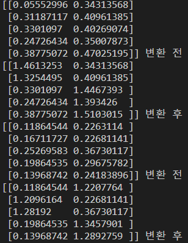

# Cart_Pole with reinforcement learning

#### 액션 정의

```python
def left():
    global action
    action = 0

def right():
    global action
    action = 1
```

#### 환경 초기화

```python
import gymnasium as gym
import time
from pynput import keyboard
listener = keyboard.GlobalHotKeys({
    'k': left,  # k는 왼쪽으로 이동
    'l': right  # l은 오른쪽으로 이동
})

listener.start()
##############################################

env = gym.make('CartPole-v1', render_mode="human")
env.reset()
print("READY!")
time.sleep(2)
```

```python
while True:
    # env.step 진행
    _, _, done, _, _ = env.step(action)

    if done:
        print("GAME OVER! score: {}".format(score))
        time.sleep(1)
        break

    score += 1
    time.sleep(0.1)
```

```python
_, _, done, _, _ = env.step(action)
```
```python
(method) def step(action: Any) -> tuple[Any, SupportsFloat, bool, bool, dict[str, Any]]
```
#### env.step(action) 메소드의 반환되는 값 :  (observation, reward, done, info), 지금은 done만 반환함.
> 입력인자: action (ActType): 에이전트가 환경 상태를 업데이트하는 데 사용하는 액션<br/>
- 반환값:</br>
1. observation : 에이전트 액션으로 인해 다음 관측값으로 환경 관측 공간의 요소</br>
예를 들면 CartPole의 폴 위치와 속도를 포함하는 numpy 배열입니다.</br>
2. reward : 액션을 수행한 결과로써의 보상. 
3. terminated (bool): 에이전트가 태스크의 MDP에 따라 달성 상태에 도달한 경우 양수 또는 음수가 될 수 있습니다.</br>
4. truncated (bool): MDP 범위를 벗어난 절단 조건이 충족되는지 여부입니다.<br/>
일반적으로 이것은 시간 제한이지만, 에이전트가 물리적으로 경계를 넘어섰음을 나타내는 데 사용될 수 있습니다. 종료 상태에 도달하기 전에 에피소드를 조기 종료하는 데 사용할 수 있습니다.참이면 사용자는 reset을 호출해야합니다.
5. info (dict): 보조 진단 정보를 포함합니다(디버깅, 학습 및 로깅에 유용합니다).
이것은, 예를 들어, 에이전트의 성능 상태를 설명하는 메트릭, 관찰에서 숨겨진 변수 또는 전체 보상을 생성하는 데 결합되는 개별 보상 항목을 포함할 수 있습니다.
6. done (bool): (Deprecated) 에피소드가 종료되었는지 여부를 나타내는 부울 값입니다. 이 경우 추가적인 step 호출은 정의되지 않은 결과를 반환합니다. 이것은 OpenAI Gym v26에서 terminated 및 truncated 속성으로 대체되었습니다.
done 신호는 서로 다른 이유로 발생할 수 있습니다. 태스크가 성공적으로 해결되었을 수도 있고, 일정한 시간 제한을 초과했을 수도 있으며, 물리학 시뮬레이션이 잘못된 상태에 들어갔을 수도 있습니다.

terminated와 done은 비슷한 의미를 가지고 있지만, done은 더 이상 사용되지 않으며 terminated와 truncated 속성이 함께 사용됩니다. 이전 버전의 OpenAI Gym에서는 done이 사용되었지만, v26부터는 terminated와 truncated 속성이 도입되어 더 정확하고 일관된 정보를 제공하게 되었습니다.

####  cart_pole 이 일정각도이상 기울어지면 done이 되도록 설정되어있다.
즉 done = 1 이 되면서 
```python
if done:
        print("GAME OVER! score: {}".format(score))
        time.sleep(1)
        break
```

#### 위의 코드에 의해 게임이 종료된다.
>여기까지 user가 직접 게임을 플레이하는 코드로 cart-pole game의  대략적인 게임 흐름을 알아보았다. 

## Reinforcement Learning
####
```python
from keras.models import Sequential
```
#### keras의 모델을 생성. 층을 쌓아가는 방식의 모델
```python
from keras.layers import Dense
```
- Dense : 인공신경망의 fully connected layer를 만들어주는 라이브러리

- Flatten : 추출된 주요 특징을 fully connected layer에 전달하기 위해 1차원 자료로 바꿔주는 layer 라이브러리


#### 층을 쌓아가는데 사용되는 레이어, # input_dim은 입력값의 차원을 나타내며, activation은 활성화 함수를 지정
```python
from keras.optimizers import Adam
```
#### 최적화 함수로 Adam을 사용할 것이므로 Adam을 import한다.

```python
model = Sequential()
```
#### 모델을 먼저 생성하였다.
```python
model.add(Dense(32, input_dim=4, activation='relu'))
model.add(Dense(16, activation='relu'))
model.add(Dense(16, activation='relu'))
model.add(Dense(2, activation='linear'))
```
#### 4개의 layer를 생성하였다.</br>
```python
model.compile(loss='mse', optimizer=Adam(learning_rate=0.001), metrics=['accuracy'])
```
> 손실함수는 mse , 최적화 함수는 Adam으로 설정하였다.
### Optimaiers
1. GD : 모든 자료를 검토
2. SGD : 일부 자료만 검토, 빠르지만 정확도가 떨어짐

- Step 방향 관점 : 
1. Momentum : 관성을 이용하여 이동
2. NAG : Momentum을 이용하여 이동하되, 미래의 위치를 예측하여 이동
3. Nadam : NAG + Adam, 관성, 방향, 사이즈 모두 고려

- Step size 관점 :
1. Adagrad : 안가본곳은 step size를 크게 많이 가본 곳은 step size를 줄여서 탐색
2. RMSProp : Adagrad의 단점을 보완, 이전 학습의 맥락을 고려하여 step size를 조절
3. Adam : RMSProp + Momentum 방향과 사이즈 모두 고려

이번 cart_pole 강화학습에서는 ADAM을 사용하였다.


- Input layer(입력층): 예측값(출력 변수)를 도출하기 위한 예측변수(입력변수)의 값들을 입력하는 역할로 만약 n개의 입력값이 있다면 n개의 노드를 보유

- Hidden layer(은닉층): 모든 입력 노드들로부터 입력값을 받아 가중합을 계산하고, 이 값을 전이 함수에 적용하여 출력층에 전달. 각 입력 노드와 은닉 노드, 출력 노드들은 모두 가중치를 가지는 망으로 연결.

- Output layer(출력층): 입력 변수들마다의 가중치로 계산된 예측값 표현 역할 

 
> Input layer(입력층)의 input_dim = 4 는 입력을 4개 받는다는 뜻이다.
이 4가지의 입력은 카트의 위치, 카트의 속도, 막대기의 각도, 막대기의 각속도 를 의미한다.
> Hidden layer(은닉층)의 활성화 함수는 ReLu를 사용하였다.
> Output layer(출력층)의 활성화 함수는 회귀의 경우 linear, 다중분류의 경우 softmax를 사용한다.
>첫번째 Layer의 입력차원은 4차원이다, 이는 카트의 위치, 카트의 속도, 막대기의 각도, 막대기의 각속도를 의미한다.</br>
>각 Layer의 출력과 다음 Layer의 입력은 꼭 같을 필요는 없다. 학습모델에 따라서 달라진다.
>Hidden Layer의 활성화 함수는 relu를 사용하였다.
>ReLU로 학습을 해본후 leakyReLU 등등 다른 actibation function도 사용해봐야겠다.
>마지막 Layer의 출력은 가능한 액션의 개수에 해당하는 뉴런 수 2가지(왼, 오)이다.
>마지막 Layer의 활성화 함수는 linear를 사용하였다.
>마지막 Layer의 활성화 함수는 일반적으로 회귀에는 linear, 분류에는 softmax를 사용한다.

## Q-learning을 다음 순서로 진행할 예정이다.

1. model을 생성한다.
```python
model = Sequential()
```
2. model에 layer를 추가한다.
```python
model.add(Dense(32, input_dim=4, activation='relu'))
model.add(Dense(16, activation='relu'))
model.add(Dense(16, activation='relu'))
model.add(Dense(2, activation='linear'))
```
3. model을 compile한다.
```python
model.compile(loss='mse', optimizer=Adam(learning_rate=0.001), metrics=['accuracy'])
```
4. model을 이용하여 예측한다
```python
target = model.predict(state)
```
5. model을 학습시킨다.
```python
model.fit(state, target, epochs=1, verbose=0)
```


#### 다음은 q-learning을 위한 벨만방정식 코드이다.
```python
np.amax(array, axis=None, out=None, keepdims=<no value>, initial=<no value>)
target = (reward + 0.95 * np.amax(model.predict(next_state, verbose = 0), axix=1))
```

#### axis 매개변수는 다차원 배열에서 연산을 수행할 축(axis)을 지정하는 매개변수입니다.</br>
#### 예를 들어, 2차원 배열에서 axis=0으로 설정하면, 각 열(column)을 기준으로 연산을 수행하며, axis=1로 설정하면 각 행(row)을 기준으로 연산을 수행합니다.<br/>
#### np.amax() 함수에서 axis 매개변수는 최대값을 찾을 축을 지정합니다. 따라서 np.amax(array, axis=1)은 2차원 배열에서 각 행(row)마다 최대값을 찾아 반환합니다.</br>

예를 들어, 
```python
array = np.array([[1,2,3],[4,5,6]])
```
이라는 2차원 배열이 있을 때, np.amax(array, axis=1)을 실행하면 [3, 6]이 반환됩니다. </br>
첫 번째 행에서 최대값은 3이며, 두 번째 행에서 최대값은 6입니다.</br>
> amax를 이용하여 최대 q-value를 구해보려고 하였지만 실패했습니다. </br>

#### 초기학습과 minibatch를 이용한 학습을 구분하여 진행하였다.
>다음과 같이 minibatch를 이용한 코드를 구성하였다.
```python
        # 메모리에 데이터 수가 배치 크기에 도달하면 학습 실행
        if len(memory) > batch_size:
            minibatch = random.sample(memory, batch_size)
            for state, action, reward, next_state, done in minibatch:
                if done:
                    target_f = model.predict(state, verbose=0)
                elif not done:
                    reward = (reward + 0.95 *
                              np.max(model.predict(next_state, verbose = 0), axix=1))
                model.fit(state, target_f, epochs=1, verbose=0)
```
```python
action = np.argmax(model.predict(state))
```
#### 이 부분에서 오류가 발생한다.
>학습데이터가 mini batch사이즈보다 많이 쌓이면 mini batch사이즈만큼 랜덤하게 뽑아서 학습을 진행한다.
>minibatch에서 state, action, reward, next_state, done을 뽑아서 target을 계산한다
>하지만 계속 array size에 대한 오류가 뜬다.
```phython
In[0] and In[1] has different ndims: [4] vs. [4,32]
         [[{{node sequential/dense/Relu}}]] [Op:__inference_predict_function_1384]
```
입력층의 차원배열 오류가 계속해서 발생한다.
```python
state = np.reshape(state, [1, 4])
```
를 이용해서 차원을 맞춰주려했지만 계속 실패하고 있다.
#### state, action, done의 배열을 다시 확인해봐야겠다.


```python
import random
import gymnasium as gym
import numpy as np
from keras.models import Sequential
from keras.layers import Dense
from keras.optimizers import Adam

model = Sequential() # 객체 생성
model.add(Dense(32, input_dim=4, activation='relu'))
model.add(Dense(16, activation='relu'))
model.add(Dense(16, activation='relu'))
model.add(Dense(2, activation='linear'))
model.compile(loss='mse', optimizer=Adam(learning_rate=0.001), metrics=['accuracy'])


env = gym.make('CartPole-v1')
state, info = env.reset()
print(state)
print(info)

for i in range(10):
    action = env.action_space.sample()
    print("랜덤샘플로 추출한 액션",action)
    next_state, reward, done, _ , _ = env.step(action)
    print(next_state, reward, done)
```
model만 따로 분리해서 몇차원 배열인지 확인해 보았다
state는 [ 0.0443348  -0.02882837 -0.00968079 -0.00089348] 형태이므로 1차원 배열이다.


```python
action = np.argmax(model.predict(np.array([state])))
```
>np.array(np.array([state]))를 통해 2차원 numpy array로 바꿔주었다.
```python
states = np.array([x[0] for x in minibatch])
actions = np.array([x[1] for x in minibatch])
rewards = np.array([x[2] for x in minibatch])
next_states = np.array([x[3] for x in minibatch])
dones = np.array([x[4] for x in minibatch])
```
>minibatch에서 state, action, reward, next_state, done을 numpy array로 뽑아서 사용하였다.
#### 코드가 실행됨을 확인하였다.
- 하지만 이것은 대헌씨의 코드에서 가져온 것이기때문에 이 코드를 분석해본 후 다시 나의 코드로 돌아가 어떤 부분에서 오류가 나는지 확인해보았다.
```python
 target_y = model.predict(states, verbose=0)
            print(target_y,"변환 전")
            target_y[range(32), actions] = rewards + (1 - dones) * 0.95 * np.max(model.predict(next_states, verbose=0), axis=1)
            print(target_y,"변환 후")
            model.fit(states, target_y, epochs=1, verbose=0)
```
#### target_y[range(32), actions] 벨만방정식에 사용되는 이 문법이 이해가 되질 않는다.
#### 그래서 batch size를 5개로 줄인 후 변환전과 변환 후의 값을 확인해보았다.

> 변환전과 변환후의 배열의 크기가 같다는 것을 확인하였다.<br/>
> 값도 비교해본결과 두개의 원소중 하나만 다른 것을 확인하였다. <br/>
> 이것은 벨만방정식에 의해 어떤 액션을 취했을 때의 Q-value가 변했기때문에 그것을 반영한 것이라고 생각했다.<br/>


#### 나의 코드로 다시 돌아와서

```python
        # 메모리에 데이터 수가 배치 크기에 도달하면 학습 실행
        if len(memory) > batch_size:
            minibatch = random.sample(memory, batch_size)
            for state, action, reward, next_state, done in minibatch:
                if done:
                    target_f = model.predict(state, verbose=0)
                elif not done:
                    reward = (reward + 0.95 *
                              np.max(model.predict(next_state, verbose = 0), axix=1))
                model.fit(state, target_f, epochs=1, verbose=0)
```

>if done:  , elif not done: 으로 action이 취해졌을 때와 아닐때의 상황을 나누어 target_y의 값을 구한다.<br/>
>이 부분에서 오류가 난다고 생각하였다.<br/>
>이것은 done이 true일때와 false일때의 상황을 나누어서 target_f을 구하려고 하였지만<br/>
>이때의 done은 bool이 아니라 32,1의 차원을 가지고 있기 때문에 오류가 발생한다 라고 생각하였다.<br/>
> 32개의 batch size를 가지고 있기 때문에 32개의 target_f을 구해야하는데<br/>
> 위와 같이 for문으로 구성하면 for문에 의해 실행되지 않을뿐 아니라 32개의 target_f을 구하지 못한다.<br/>


```python
import random
import gymnasium as gym
import numpy as np
from keras.models import Sequential
from keras.layers import Dense
from keras.optimizers import Adam
model = Sequential()
model.add(Dense(32, input_dim=4, activation='relu'))
model.add(Dense(16, activation='relu'))
model.add(Dense(16, activation='relu'))
model.add(Dense(2, activation='linear'))
model.compile(loss='mse', optimizer=Adam(learning_rate=0.001), metrics=['accuracy'])

env = gym.make('CartPole-v1')

memory = []
scores = []

EPISODES = 1000
TIME_STEP = 1000
epsilon = 1.0
batch_size = 5


for episode in range(EPISODES):
    
    state, info = env.reset()
    
    done = False
    score = 0
    epsilon = 0.95 * epsilon

    for t in range(TIME_STEP):

        if np.random.rand() <= epsilon:
            action = env.action_space.sample()
        else:
            action = np.argmax(model.predict(np.array([state]), verbose=0))
        next_state, reward, done, _ , _ = env.step(action)
        

        reward = reward if not done else -10
        memory.append((state, action, reward, next_state, done))
        


        if len(memory) > batch_size:
            minibatch = random.sample(memory, batch_size)
            states = np.array([x[0] for x in minibatch])  # 32 x 4 어레이
            actions = np.array([x[1] for x in minibatch])  # 32 x 2 어레이
            rewards = np.array([x[2] for x in minibatch])  # 32 x 1 어레이
            next_states = np.array([x[3] for x in minibatch])  # 32 x 4 어레이
            dones = np.array([x[4] for x in minibatch])  # 32 x 1 어레이 (done이면 1, 아니면 0)

            target_y = model.predict(states, verbose=0)
            target_y[range(5), actions] = rewards + (1 - dones) * 0.95 * np.max(model.predict(next_states, verbose=0), axis=1)
            model.fit(states, target_y, epochs=1, verbose=0)

        # 다음 state로 이동
        state = next_state
        score = t
        scores.append(t)
        
        # 게임 종료
        if done:
            break
        

    # 점수 기록
    scores.append(score)
    # 평균 점수 계산
    mean_score = np.mean(scores[-10:])
    if len(scores) > 15:
        scores.pop(0)
    #점수 출력    
    print("Episode {:4d}  score : {:4d}  Mean score: {:4.2f}".format(episode, score,mean_score))
    # 평균 점수가 250 이상이면 학습 중단
    if mean_score >= 450:
        print("Solved after {} episodes!".format(episode))
        break
```
